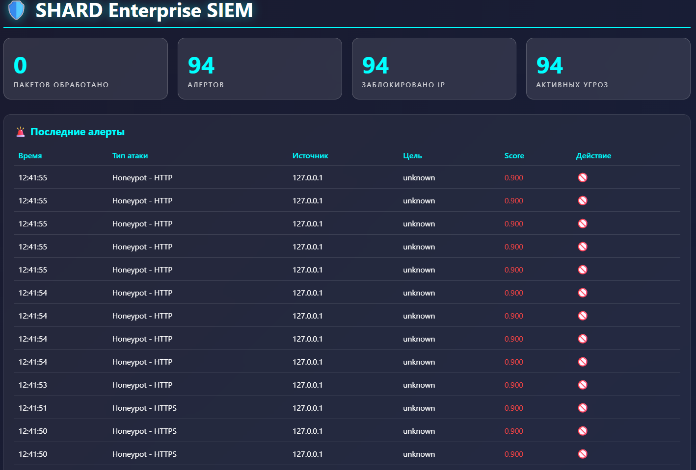
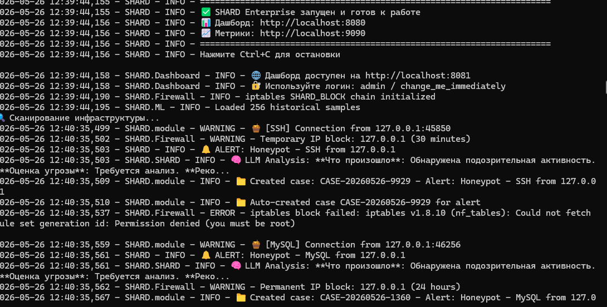
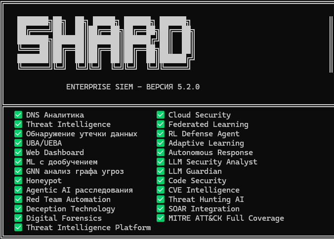

# 🛡️ SHARD Enterprise SIEM

> Autonomous AI-driven SIEM platform with real-time threat detection, autonomous response, and multi-model cyber defense.

---

# 🚀 Overview

SHARD Enterprise SIEM is an autonomous cybersecurity platform designed to detect, investigate, and respond to cyber threats in real time using multiple AI/ML models.

The platform combines:

- Deep Packet Inspection
- AI-based anomaly detection
- Threat intelligence
- Autonomous incident response
- MITRE ATT&CK mapping
- Behavioral analytics
- Digital forensics
- Deception technologies

into a unified AI-native security architecture.

---

# ⚡ Core Features

## 🤖 AI Security Engine

SHARD uses 10 integrated AI/ML systems:

| Model | Purpose |
|---|---|
| XGBoost | Threat classification |
| Random Forest | Event analysis |
| Isolation Forest | Anomaly detection |
| Seq2Seq Transformer | Sequence threat prediction |
| Variational Autoencoder | Unknown attack detection |
| Graph Neural Network | Threat graph analysis |
| Temporal GNN | MITRE ATT&CK correlation |
| Attention LSTM | Temporal behavior analysis |
| RL DQN Agent | Autonomous response |
| Multi-Modal Fusion | Cross-source threat fusion |

---

# 🛡️ Security Modules

## Included Modules

- Web Application Firewall
- Deep Packet Inspection
- Honeypot System (13 services)
- DNS Analyzer
- Threat Intelligence
- User Behavior Analytics
- EDR Integration
- Cloud Security Monitoring
- Threat Hunting AI
- CVE Intelligence
- Lateral Movement Detection
- Attack Chain Tracker
- Digital Forensics
- SOAR Integration
- Deception Technology

---

# 🧠 Autonomous Response

SHARD can autonomously:

- Detect malicious behavior via 10 neural networks
- Correlate attack chains using MITRE ATT&CK
- Block malicious IPs through iptables
- Generate forensic incident reports
- Track lateral movement
- Deploy deception responses

---

# 📊 MITRE ATT&CK Integration

- 835 ATT&CK techniques mapped
- Attack chain reconstruction
- Threat actor behavior analysis
- Lateral movement detection
- Automatic ATT&CK mapping

---

# 🏗️ Architecture

Traffic Sources
       ↓
Packet Capture Layer
       ↓
Feature Extraction
       ↓
AI Detection Pipeline
       ↓
Threat Correlation Engine
       ↓
Autonomous Response System
       ↓
SIEM Dashboard / Alerts
📦 Technology Stack
Component	Technology
Backend	Python 3.11
AI/ML	PyTorch, Scikit-learn
Infrastructure	Docker
Monitoring	Prometheus + Grafana
Notifications	Telegram
Data Processing	AsyncIO
🚀 Quick Start
Requirements
Docker
Docker Compose
8+ GB RAM
20+ GB free disk space
Installation
git clone https://github.com/misha622/shard-siem.git
cd shard-siem
docker-compose up -d
Logs
docker-compose logs -f shard
📈 Production Readiness
Metric	Status
Unit Tests	60
Integration Tests	4
Code Quality	8.29/10
Security Audits	25
Critical Vulnerabilities	0
Bugs Fixed	250+
🔥 Threat Detection Pipeline

SHARD analyzes:

Network traffic
DNS activity
User behavior
Authentication events
Cloud telemetry
Endpoint activity

to identify:

Data exfiltration
Lateral movement
Malware behavior
Brute force attacks
Command & control activity
Insider threats
📸 Screenshots

### Dashboard

### Threats

### Alerts

🎥 Demo
https://youtube.com/shorts/aeyiGMYsbn0?si=b5GO0zHzIJV2Q2P6

📚 Roadmap
v5.3
Kubernetes support
Advanced SOAR playbooks
Federated AI training
Distributed threat graph
v6.0
Autonomous SOC mode
AI-generated threat reports
Real-time adaptive policies
🤝 Contributing

Contributions are welcome.

fork → feature branch → pull request
⚠️ Disclaimer

This project is intended for:

Research
Educational purposes
Authorized environments only

Users are responsible for compliance with applicable laws and regulations.

📄 License

MIT License

⭐ Support The Project

If you find SHARD useful:

Star the repository
Share the project
Contribute improvements
Report issues

